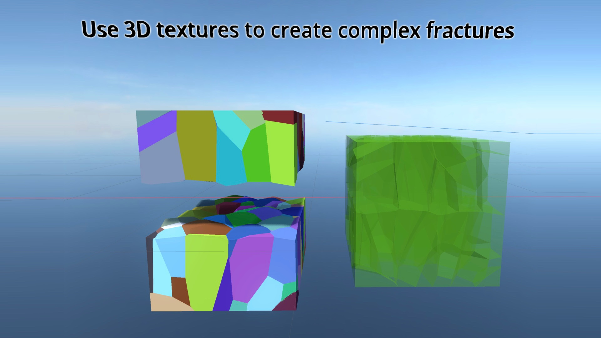
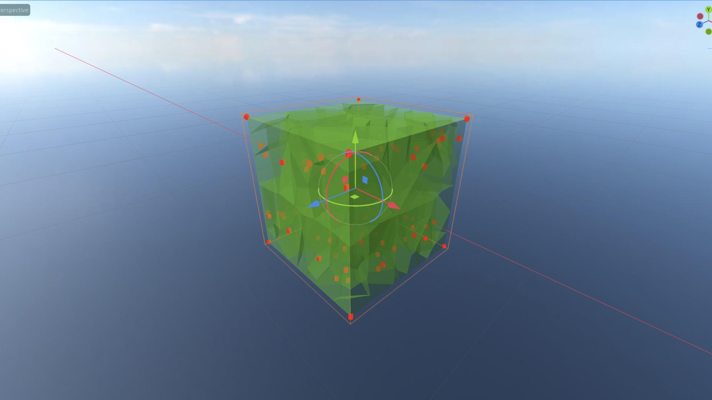
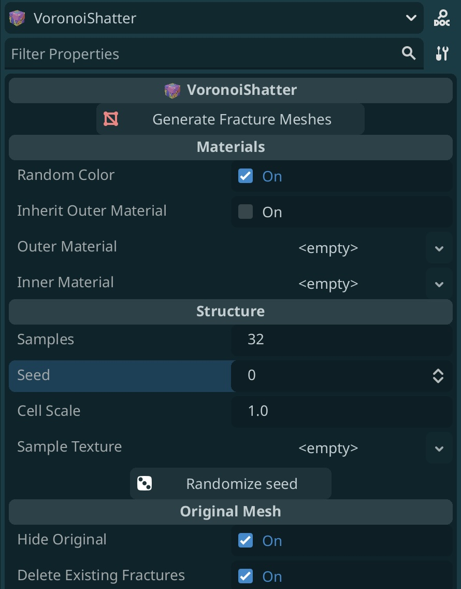

<p align="center">
  <a href="https://woolly.one/voronoishatter">
    
  </a>
</p>

# VoronoiShatter
An easy and dynamic way to create Voronoi fracture geometry for your Godot game.

> [!IMPORTANT]
> This version of the README applies to v0.2 of VoronoiShatter. [Click here if you're still using v0.1.](https://github.com/robertvaradan/voronoishatter/blob/master/README.md?at=e6c83e642438383620870a8d5d3b73c81c24e77d)

<p align="center">
    
    
</p>
<p align="center">
    
    
</p>


# Features
* ✅ Create complex fractures from both convex and concave meshes
* ✅ Seamless Voronoi geometry and materials with high fidelity to your mesh
* ✅ Quickly generator rigidbodies from fractures for cool physic simulations
* ✅ Native GDScript - use this in any Godot game
* ✅ C# adapter classes for a seamless experience cross-language 

# Installation

1. Download this repository (or the release files) and copy `addons/voronoishatter` to `<your project>/addons`.
2. Load the plugin by going to Project Settings > Plugins and enable the plugin in the list.
3. Optional: open the example project to see a couple examples, including the teapot shatter example.

# Usage
There are two ways to use this tool: in the editor, and in your project's code to use the underlying tools.

## In the editor (recommended)
Voronoi shatter meshes can be generated using a custom node, **VoronoiShatter**, that is loaded with the plugin after it's installed. **Please note:** This plugin is highly experimental. It has not been tested on a large variety of machines. I have found it to be relatively stable, but you MAY experience crashes, so make sure to save before generating fracture meshes.

<div>
    
</div>


### VoronoiShatter Node
This is the way to run this tool in the editor. Simply create this node in your scene, add a **MeshInstance3D** as a child, and click "**Generate Fracture Meshes**." Depending on your hardware, the below settings, and complexity of the mesh itself, the mesh will generate in seconds in a **VoronoiCollection** node. Make sure the mesh you are shattering is **manifold**—no surface should have any disconnected points, or the underlying CSG combiner mechanism will return an empty set of meshes.

* **Random Color** - Assigns a random color to each Voronoi fragment after generation. This is helpful for previewing the geometry itself to see how your settings influence generation.
* **Inherit Outer Material** - Assigns the same material that the parent mesh currently has to all surfaces except the inner fracture surfaces.
* **Outer Material** - Assigns a material to all surfaces except the inner fracture surfaces.
* **Inner Material** - Assigns an optional additional material to the inner faces of your Voronoi mesh. Allows you to do cool stuff like creating glass fragments or glowing/emissive shards.
* **Samples** - How many random points are generated inside the bounds of your mesh for creating the Voronoi cells. Because the outermost cells (e.g. cells that don't intersect with your mesh at all) are clipped to the target mesh geometry, some of these may be culled, so this only _roughly_ corresponds to the number of shards you end up with, but in general, more samples = more shards = smaller shards. **Please note:** Using a low sample count (< 6 or so) may lead to loss in geometry depending on the seed.
* **Seed** - Determines the RNG seed used for generating samples (has restricted effect if using a 3D texture).
* **Cell Scale** - Allows you to adjust the local scale of the generated Voronoi cell meshes so you can make them overlap or add more separation between one another.
* **Sample Texture** - 3D texture used to direct the pattern where the samples are generated. (In general: lighter = more likely a sample shows up at a spot, using rejection-based random sampling)
* **Hide Original** - Hide the target mesh after generating.
* **Delete Existing Fractures** - Deletes any VoronoiCollections that are children of this node when "Generate Fracture Meshes" is clicked again.

### VoronoiCollection Node
This is a simple node that is created with the mesh fragments. In the inspector, you can use the "**Create Rigid Bodies**" button to create rigid bodies and simple Voronoi shard collision shapes for convenience. Note: this can be slow on high mesh counts or complex geometry. Use at your own risk.

## In code
Generally speaking, the most efficient way to use this plugin in code is to create a `VoronoiGenerator` node, register it as a singleton (or use dependency injection), and call the various functions it contains. 

GDScript:
```c
    var voronoi_generator = VoronoiWorker.new()
    Engine.register_singleton("MyVoronoiGenerator", voronoi_generator)
```

In C#, you can use the `Adapted` classes that make cross-language scripting much easier.
C#:
```csharp
    var voronoiGenerator = AdaptedVoronoiGenerator.New(); // Creates the object assuming you installed this in your `addons` folder
    // Similar code for registering the singleton ...
```

Then, use the `create_from_mesh(target_mesh, config)` function on `VoronoiGenerator` to create the VoronoiGeometry and return it as an Array[Vector3].

The `VoronoiGeneratorConfig` is of the following format:

```
# The seed influencing sample point placement
var random_seed: int
# The number of samples to intersperse in the AABB
var num_samples: int
# (optional) A 3D texture to finely control the seed placement
var texture: Texture3D
```

GDScript:

```
    var config = VoronoiGeneratorConfig.new()
    config.random_seed = 13240324032
    config.num_samples = 100
    
    var voronoi_generator = Engine.get_singleton("MyVoronoiGenerator", voronoi_generator)
    var results = voronoi_generator.create_from_mesh(my_awesome_mesh, config)
    ... create the meshes and add them as children to the scene, e.g ...
```

C#
```csharp
    var voronoiGenerator = Engine.GetSingleton("MyVoronoiGenerator") as AdaptedVoronoiGenerator;
    var config = AdaptedVoronoiGeneratorConfig.New();
    config.RandomSeed = 13240324032;
    config.NumSamples = 100;

    List<AdaptedVoronoiMesh> results = voronoiGenerator.CreateFromMesh(myAwesomeMesh, config);
```

### Tips for making this tool actually useful to you
* **Pre-shatter your meshes in the editor** — It's theoretically possible to run the tool "just in time" in a game, but the performance implications are such that pre-fragmenting your mesh and dynamically showing it makes a lot more sense.
* **Stick to triplanar materials on the inner faces** - The UV maps aren't calculated for the inner shard faces, so it's best to use triplanar materials for the inner faces. The UVs from the outer meshes are transferred properly.
* **Use manifold geometry** - If you attempt to use a mesh that has surfaces with "loose" geometry (that is, a surface that has some vertices that are disconnected), internal faces, areas with no thickness, or non-planar faces, you will likely end up with an empty VoronoiCollection as a result.

# Changelog
## v0.2
* Added CSharp bridge `Adapter` classes for easier cross-language scripting.
* Much more dev-friendly experience.
* Completely retooled how generator is done and removed a lot of unecessary classes. Everything is now done on the main UI thread, with the main bottlenecks sorted out.
* Rendering the samples in the UI is faster. Some slight performance gains from disabling signals on generated meshes.

## v0.0.1
* First version of the tool. Yay!