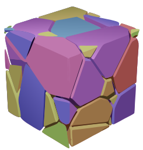
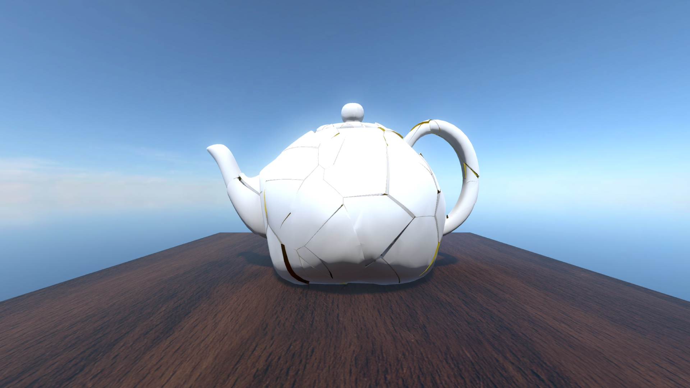
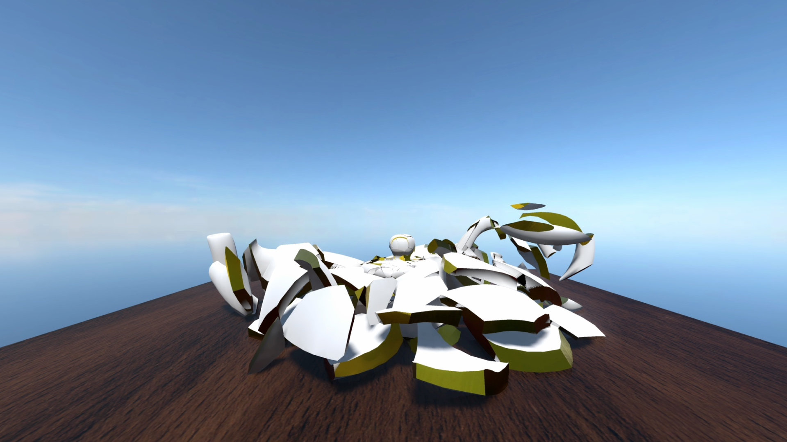

<p align="center">
  <a href="https://woolly.one/voronoishatter">
    
  </a>
</p>

# VoronoiShatter
An easy and dynamic way to create Voronoi fracture geometry for your Godot game.

<p align="center">
    
    
</p>


# Features
* ✅ Create complex fractures of both convex and concave meshes
* ✅ Seamless Voronoi geometry and materials with high fidelity to your mesh
* ✅ Create rigidbodies from fractures for cool physic simulations
* ✅ Multi-threaded worker class for parallelized
* ✅ Native GDScript - use this in any Godot game

# Installation

1. Download this repository (or the release files) and copy `addons/voronoishatter` to `<your project>/addons`.
2. Load the plugin by going to Project Settings > Plugins and enable the plugin in the list.
3. Optional: open the example project to see a couple examples, including the teapot shatter example.

# Usage
There are two ways to use this tool: in the editor, and in your project's code to use the underlying tools.

## In the editor (recommended)
Voronoi shatter meshes can be generated using a custom node, **VoronoiShatter**, that is loaded with the plugin after it's installed. **Please note:** This plugin is highly experimental. It has not been tested on a large variety of machines. I have found it to be relatively stable, but you MAY experience crashes, so make sure to save often when using the plugin.

### VoronoiShatter Node
This is the way to run this tool in the editor. Simply create this node in your scene, add a **MeshInstance3D** as a child, and click "**Generate Fracture Meshes**." Depending on your hardware, the below settings, and complexity of the mesh itself, the mesh will generate in seconds in a **VoronoiCollection** node.

#### Random Color
Assigns a random color to each voronoi fragment after generation. This is helpful for previewing the geometry itself.

#### Inherit Outer Material
Assigns the same material that the parent mesh currently has to this mesh.

#### Inner Material
Assigns an option additional material to the inner faces of your voronoi mesh. Allows you to do cool stuff like creating glass fragments or glowing/emissive shards.

#### Samples
How many random points are generated inside the bounds of your mesh for creating the voronoi cells. Because the outermost cells (e.g. cells that don't intersect with your mesh at all) are clipped to the target mesh geometry, some of these may be culled, so this only _roughly_ corresponds to the number of shards you end up with, but in general, more samples = more shards = smaller shards. **Please note:** Using a low sample count (< 6 or so) may lead to loss in geometry depending on the seed.

#### Seed
Determines the RNG seed used for generating samples (has restricted effect if using a 3D texture).

#### Cell Scale
(v0.0.1 Not yet implemented) Allows you to adjust the precise scale of the Voronoi cell meshes so you can make them overlap or add more separation between one another.

#### Sample Texture
3D texture used to direct the pattern where the samples are generated. (In general: lighter = more likely a sample shows up at a spot, using rejection-based random sampling)

#### Hide original
Hide the target mesh after generating.

#### Delete existing fractures
Deletes any VoronoiCollections that are children of this node when "Generate Fracture Meshes" is clicked again.

### VoronoiCollection Node
This is a simple node that is created with the mesh fragments. In the inspector, you can use the "Create Rigid Bodies" button to create rigid bodies and simple Voronoi shard collision shapes for convenience. Note: this can be slow on high shard counts or complex geometry. Use at your own risk.

## In code
Generally speaking, the most efficient way to use this plugin in code is to create a `VoronoiWorker` node, register it as a singleton (or use dependency injection), and start the worker threads. 

GDScript:
```
    var voronoi_worker = VoronoiWorker.new()
    voronoi_worker.start_worker(WORKER_COUNT)
    Engine.register_singleton("MyVoronoiWorker", voronoi_worker)
```

C#:
```
    var voronoiWorker = GD.Load<GDScript>("res://addons/voronoishatter/model/voronoiworker.gd");
    var voronoiWorker = (GodotObject) myGDScript.New();
    voronoiWorker.Call("start_worker", WORKER_COUNT);
    // Similar code for registering the singleton ...
```

Then, you can listen to the worker's `mesh_generated` signal that emits a `VoronoiWorkerResult` **and then** call a function from `VoronoiGenerator`. To perform all the logic at once like the editor nodes do, use `VoronoiGenerator.create_from_mesh(target_mesh, config)`.

The `VoronoiGeneratorConfig` is of the following format:

```
# The seed influencing sample point placement
var random_seed: int
# The number of samples to intersperse in the AABB
var num_samples: int
# (optional) A 3D texture to finely control the seed placement
var texture: Texture3D
# (optional, default 1.0) The size of the voronoi cell itself. Not yet implemented.
var cell_scale: float = 1.0
```

**Remember, you MUST listen to `mesh_generated`!**
There is also a `VoronoiWorker.voronoi_fracture_finished` signal that you can listen to if you need to know when an entire job has finished.

GDScript:

```
    var config = VoronoiGeneratorConfig.new()
    config.random_seed = 13240324032
    config.num_samples = 100
    
    var worker = Engine.get_singleton("MyVoronoiWorker", voronoi_worker)
    worker.mesh_generated.connect(...) # In your callback, perform logic for doing something with the mesh (e.g. adding it to the scene). Remember to use `call_deferred` before doing anything that requires the main thread!
    worker.voronoi_fracture_finished.connect(...) # In the callback, perform logic when the entire job is done. 
    VoronoiGenerator.create_from_mesh(my_awesome_mesh, config)
```

### Tips for making this tool actually useful to you
* **Pre-compose your meshes** — It's theoretically possible to run the tool "just in time" in a game, but the performance implications are such that pre-fragmenting your mesh and dynamically showing it makes a lot more sense.
* **Use VoronoiWorker** - Creating what are often dozens of MeshInstance3Ds out of thin air is an expensive operation, not to mention the complex boolean geometry that the tool leverages, so the plugin makes use of multi-threading via the included **VoronoiWorker** virtual node to improve performance. By my own testing, it improved performance 2-3x compared to generating the meshes sequentially. When editing, the worker is started immediately when the plugin loads to avoid the overhead of creating the threads dynamically. If you are going to use this tool in code, you'll want to start the threads when your own game starts in line with [the official Godot documentation](https://docs.godotengine.org/en/stable/tutorials/performance/using_multiple_threads.html).
* **Stick to triplanar materials on the inner faces** - The UV maps aren't calculated for the inner shard faces, so it's best to use triplanar materials for the inner faces. The UVs from the outer meshes are transferred properly.

# Changelog
## v0.0.1
First version of the tool. Yay!